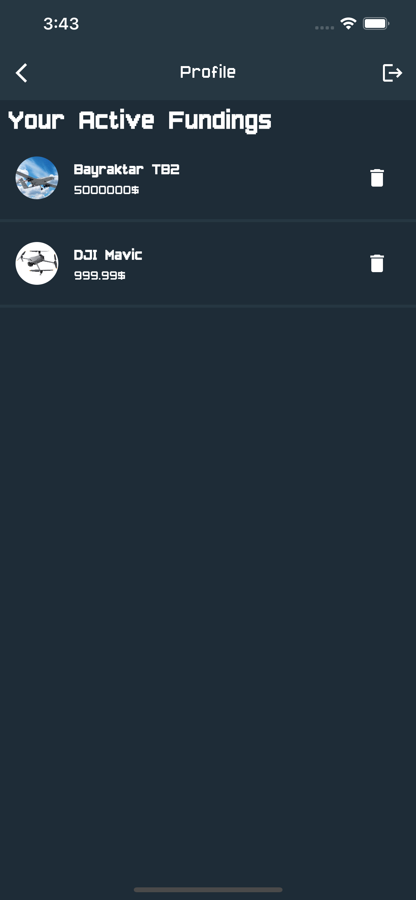

# CryptoFunding

ETH and BNB crowdfunding app.

## ⚠️ Disclaimer ⚠️
CryptoFunding uses ONLY testnet Goerli and BSC testnet chains.

### Rinkeby:

https://goerli.net

https://goerli.etherscan.io

### BSC Testnet:

https://testnet.binance.org/

https://testnet.bscscan.com

## 💰 Where can I get testnet tokens? 💰
You can claim testnet tokens for free on the links below.
### Goerli:

https://goerlifaucet.com

https://goerli-faucet.pk910.de

https://testnet.help/en/ethfaucet/goerli

### BSC Testnet:

https://testnet.binance.org/faucet-smart

https://testnet.help/en/bnbfaucet/testnet

https://testnet.dexsport.io/faucet.html

## GIF / Screenshots


| Preview | Home | Details |
|  --- |  ---    |   ---    |
||||

| Profile | Adding Item |
|  --- |  ---    |
|||

| Login | Sign Up |
|  --- |  ---    |
|||


## Setup

Download project
```bash
git clone https://github.com/vladzaba/CryptoFunding
```

Get Flutter dependencies
```bash
flutter pub get
```

Run the app
```bash
flutter run
```
